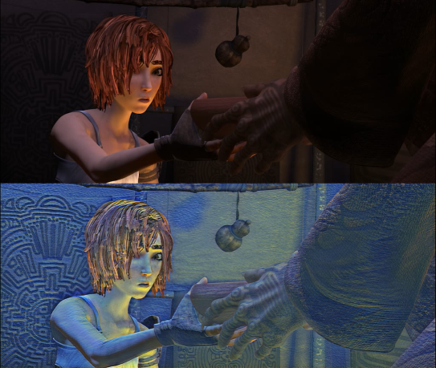
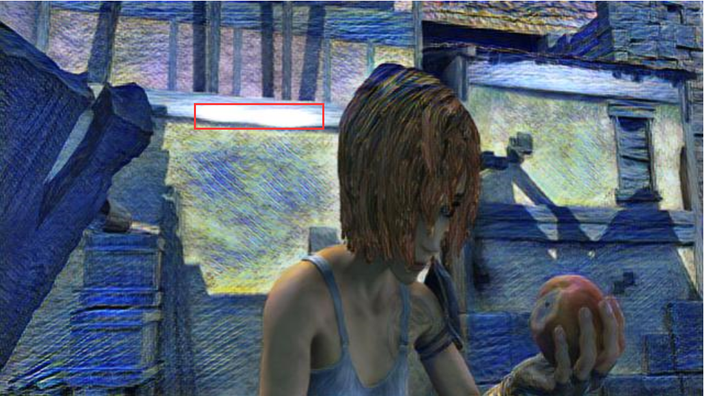

# reconect-torch-copy
This repository is based on this [repository](https://github.com/liulai/reconet-torch)

## Installation
- `conda env create --name reconet_torch --file environment.yaml`
- `conda activate reconet_torch`
- Create a `trainedl_models/` and put there all your trained models. See``model_creator.py` for more info
## Example uses:
- To see your styled video stream: `python video_real_time.py --mode video_stream` 
- For being able to style a (muted) local video: `python video_real_time.py --mode existing_video --video-source daily` 
- Same as above, but now with the original audio of the local video: `python video_real_time.py --mode existing_video --video-source daily --use-audio True`

- In any case, press the key numbers (1, 2, 3, 4 ...) to see a different styled model. Press 0 to see the original video.

These example assumes that you have a video located in `videos/daily.mp4`. If you use audio, then this will be stored in `àudios/daily.wav` 

Below is the other repository´s README
# reconet-torch
This repository contains a PyTorch implementation of the [ReCoNet paper](https://arxiv.org/pdf/1807.01197.pdf). It use a lot of code from [safwankdb](https://github.com/safwankdb/ReCoNet-PyTorch)

### Contributors:
- [Mohd Safwan](https://github.com/safwankdb)
- [Kushagra Juneja](https://github.com/kushagra1729)
- [Saksham Khandelwal](https://github.com/skq024)
- [safwankdb](https://github.com/safwankdb)

[](videos/output_shaman_1_concat01_10.avi)


## dataset
we use the MPI Sintel Dataset. The dataset contains flow fields, motion boundaries, unmatched regions, and image sequences. The image sequences are rendered with different levels of difficulty.

# Train

```bash
python train.py --phase train --path mpidataset
```

# video

```bash
python video_cv2.py --video-name 'avi/output_style.avi' --mode video_style --save-directory trained_models --model-name model.pth
```


### nodes

You can use **optim.Adam()**, it results bubble artifacts in the following red boxes. I used **optim.Adamax()** in my code.

<div align='center'>
  
</div>


